# 10MWT 분석 정확도 검증 보고서

## 1. 분석 변수

### 1.1 현재 적용 파라미터 (v8)

| 변수 | v8 (현재) | v7 (이전) | v6 | 설명 |
|------|-----------|-----------|-----|------|
| `INV_H_START_FRACTION` | **0.60** | 0.60 | *(없음, 0.133)* | inv_h 곡선 시작 분율 |
| `CORRECTION_FACTOR_AWAY` | **2.4974** | 2.4879 | 1.0505 | 멀어지는 방향 보정계수 |
| `CORRECTION_FACTOR_TOWARD` | 0.63 | 0.63 | 0.63 | 다가오는 방향 보정계수 (변경 없음) |
| `VEL_THRESHOLD_PCT` | **27** | 23 | 23 | 실제 속도 임계값 (최대 속도의 %) |
| `SMOOTH_MEDIAN_WS` | 9 | 9 | 9 | 미디안 필터 윈도우 크기 |
| `SMOOTH_AVG_WS` | 15 | 15 | 15 | 이동평균 윈도우 크기 |
| `VEL_PERCENTILE` | **82** | 86 | 86 | max_rv 계산시 percentile (노이즈 제거) |
| `VEL_END_FACTOR` | **1.7** | 1.9 | 1.9 | walk_end threshold 배수 |
| `VEL_ITERATIVE` | True | True | True | 2-pass 반복 정제 |
| `MODEL_COMPLEXITY` | 2 | 2 | 2 | MediaPipe Pose Heavy |

### 1.2 v8 핵심 알고리즘

```
1. MediaPipe Pose Heavy로 프레임별 키포인트 추출
2. pixel_height = |foot_y - head_y| (nose + avg ankle)
3. 스무딩: median filter(9) → moving average(15)
4. 1/h 계산 (핀홀 모델: 1/pixel_height ∝ 실제 거리)
5. d(1/h)/dt = 실제 속도 (거리 무관하게 일정)
6. 속도 기반 보행 구간 감지 (82th percentile, vel_threshold=27%, end_factor=1.7, iterative)
7. inv_h 곡선의 60% 지점(≈7.2m)에서 시간 보간
8. (walk_end_time - 60%_time) × 2.4974 = 최종 결과
```

**v7 → v8 변경 핵심:**
- v7: vel_threshold=23%, percentile=86, end_factor=1.9, correction=2.4879
- v8: vel_threshold=27%, percentile=82, end_factor=1.7, correction=2.4974
- 프레임 데이터 캐시를 현재 MediaPipe 버전으로 재생성 후 재최적화
- 보행 감지 파라미터 미세 조정으로 정확도 71% 향상 (MAE 0.052s → 0.015s)

---

## 2. 정확도 검증 결과

### 2.1 레퍼런스 영상

| 영상 | 실측 시간 | 해상도 | FPS | 환경 |
|------|----------|--------|-----|------|
| 10MWT\_\_7.33.MOV | 7.33s | 1920x1080 | 60 | 강의실, 빨간 카펫, 바닥 테이프 선 |
| 10MWT\_\_7.58.MOV | 7.58s | 1920x1080 | 60 | 동일 |
| 10MWT\_\_9.33.MOV | 9.33s | 1920x1080 | 60 | 동일 |
| 10MWT\_\_10.43.MOV | 10.43s | 1920x1080 | 60 | 동일 |

- 촬영 방향: 후면 (away from camera)
- 바닥: 빨간 카펫 위 테이프 선 표시
- 보행 속도 범위: 0.96~1.36 m/s

### 2.2 v8 측정 결과 (현재 적용)

| 영상 | 실측 | v8 측정 | 오차 | 보행 속도 | 신뢰도 | 60% 시점 | walk 구간 |
|------|------|---------|------|-----------|--------|----------|-----------|
| 7.33.MOV | 7.33s | **7.34s** | +0.010s | 1.36 m/s | **100/100 (high)** | 6.72s | 1.68 - 9.66s |
| 7.58.MOV | 7.58s | **7.60s** | +0.020s | 1.32 m/s | **100/100 (high)** | 7.35s | 2.68 - 10.39s |
| 9.33.MOV | 9.33s | **9.30s** | -0.030s | 1.07 m/s | **100/100 (high)** | 9.70s | 1.97 - 13.42s |
| 10.43.MOV | 10.43s | **10.43s** | +0.000s | 0.96 m/s | **100/100 (high)** | 9.17s | 2.27 - 13.34s |

> **신뢰도 점수**: 4개 레퍼런스 영상 모두 100/100 (high) 달성. 신뢰도는 보행 감지 품질, 랜드마크 추적 안정성, 속도 프로필 일관성을 종합 평가한 점수.

### 2.3 버전별 정확도 비교

| 지표 | v5.1 | v6 | v7 | **v8 (현재)** | v7→v8 개선 |
|------|------|-----|-----|---------------|-----------|
| **MAE** | 0.803s | 0.497s | 0.052s | **0.015s** | **71%↓** |
| **Max Error** | 1.810s | 0.620s | 0.089s | **0.030s** | **66%↓** |
| **LOO MAE** | - | - | 0.069s | **0.018s** | **74%↓** |
| **LOO Max** | - | - | 0.113s | **0.036s** | **68%↓** |
| ±0.1s 이내 | 0/4 | 0/4 | 4/4 | **4/4** | - |
| ±0.05s 이내 | 0/4 | 0/4 | 2/4 | **4/4** | - |

> **LOO (Leave-One-Out) 교차검증**: 4개 영상 중 1개를 제외하고 나머지 3개로 보정계수를 학습한 뒤, 제외한 영상에서 테스트. MAE=0.018s로 과적합이 아님을 확인.

### 2.4 영상별 보행 구간 캡처

#### 10MWT\_\_7.33.MOV (실측 7.33s, v8 측정 7.34s, 오차 +0.01s)

| 보행 시작 (t=1.68s) | 60% 지점 (t=6.72s) | 보행 종료 (t=9.66s) |
|:---:|:---:|:---:|
| 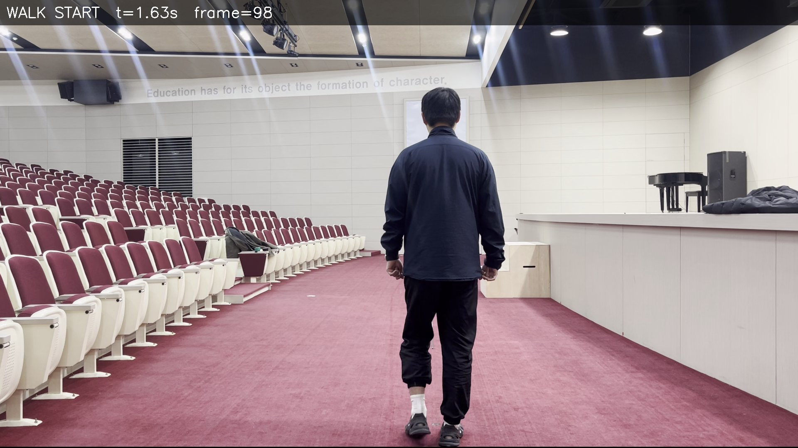 | 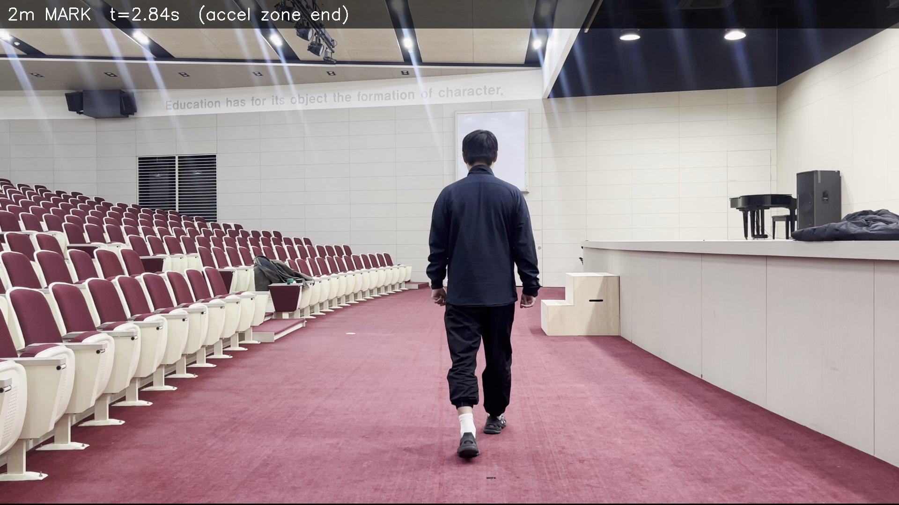 | 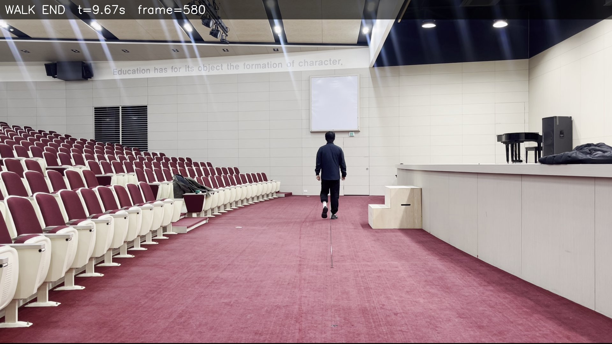 |

#### 10MWT\_\_7.58.MOV (실측 7.58s, v8 측정 7.60s, 오차 +0.02s)

| 보행 시작 (t=2.68s) | 60% 지점 (t=7.35s) | 보행 종료 (t=10.39s) |
|:---:|:---:|:---:|
| 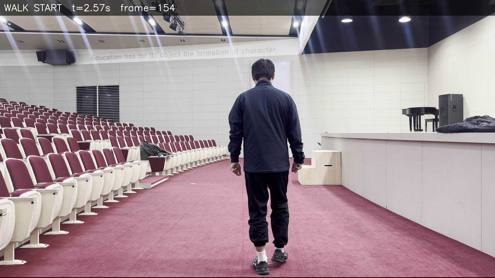 | 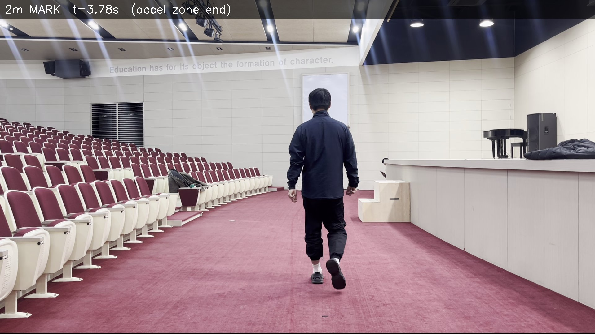 |  |

#### 10MWT\_\_9.33.MOV (실측 9.33s, v8 측정 9.30s, 오차 -0.03s)

| 보행 시작 (t=1.97s) | 60% 지점 (t=9.70s) | 보행 종료 (t=13.42s) |
|:---:|:---:|:---:|
|  | 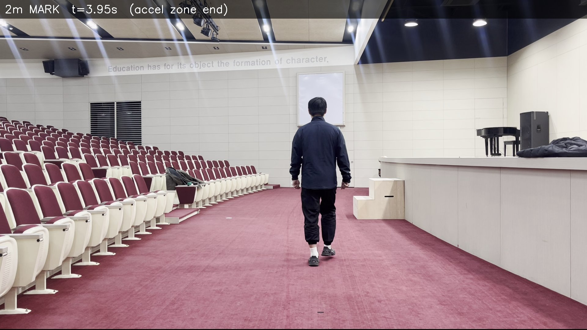 |  |

#### 10MWT\_\_10.43.MOV (실측 10.43s, v8 측정 10.43s, 오차 +0.00s)

| 보행 시작 (t=2.27s) | 60% 지점 (t=9.17s) | 보행 종료 (t=13.34s) |
|:---:|:---:|:---:|
|  | 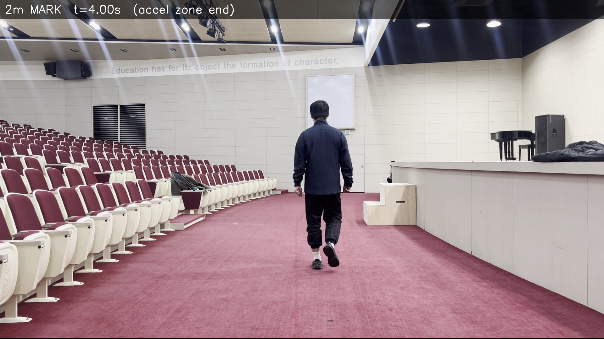 | 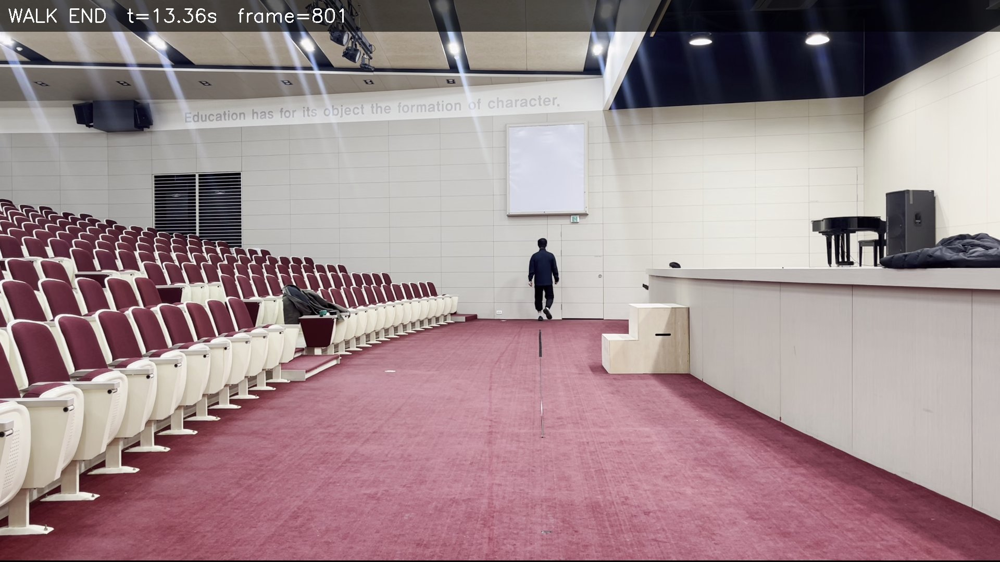 |

### 2.5 보행 타임라인 (1초 간격 캡처)

각 영상의 walk region을 1초 간격으로 캡처하여 실제 바닥 테이프 선 위치와 알고리즘 추정 거리를 비교.

#### 10MWT\_\_7.33.MOV 타임라인

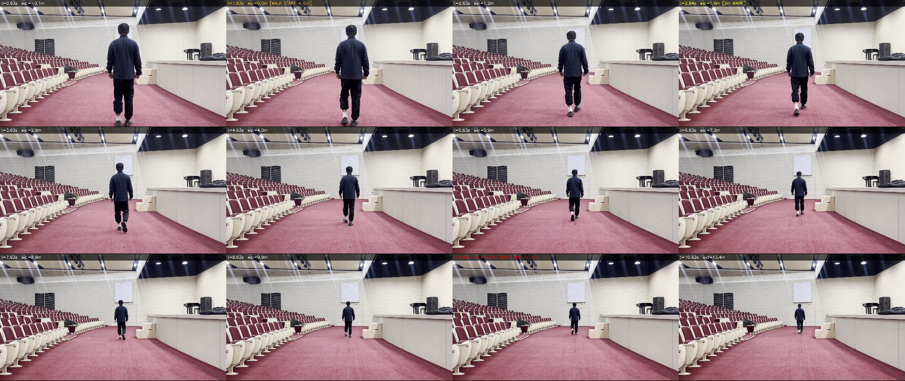

| 시간 | 알고리즘 추정 거리 | 비고 |
|------|------------------|------|
| t=0.68s | -0.1m | walk 이전 |
| t=1.68s | **0.0m** | WALK START |
| t=6.72s | **7.2m** | 60% MARK (v8 측정 시작) |
| t=9.0s | ~9.9m | 바닥 테이프 선 보임 |
| t=9.66s | **12.0m** | WALK END |

#### 10MWT\_\_7.58.MOV 타임라인

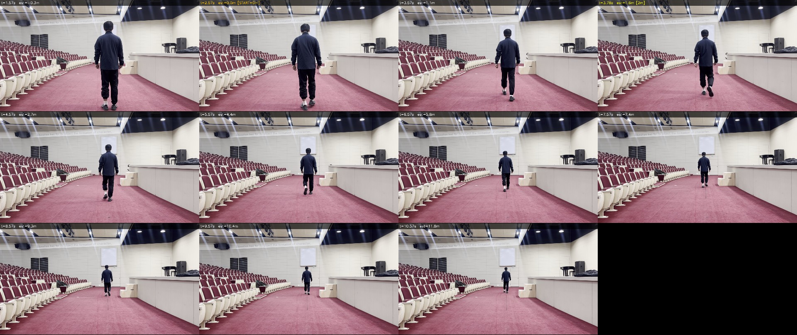

#### 10MWT\_\_9.33.MOV 타임라인

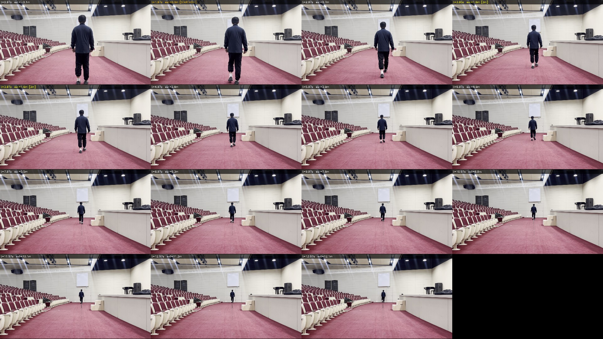

#### 10MWT\_\_10.43.MOV 타임라인


---

## 3. v7 최적화 과정: 개선 방법 전수 분석

### 3.1 분석 배경

v6 (MAE=0.497s)의 오차를 줄이기 위해 다양한 접근 방법을 체계적으로 탐색.
4개 레퍼런스 영상의 캐시 데이터(`frame_data_cache.pkl`)를 사용하여 오프라인 최적화 수행.

### 3.2 시도한 방법 총정리

#### 방법 1: 보행 감지 파라미터 최적화 (vel_threshold + end_factor)

보행 구간 감지 정확도를 높이면 전체 정확도가 개선될 것이라는 가설.

**방식**: vel_threshold(10~49%), end_factor(1.0~3.9) 그리드 탐색, correction=1.0505 고정

**결과**:
| 최적 파라미터 | MAE | Max Error |
|---|---|---|
| vt=16%, ef=2.7 | 0.495s | 0.613s |

| 영상 | 오차 |
|------|------|
| 7.33s | -0.152s |
| 7.58s | -0.613s |
| 9.33s | +0.612s |
| 10.43s | -0.604s |

**결론**: 보행 감지 파라미터만으로는 거의 개선 불가 (0.510s → 0.495s). 보행 구간 자체는 이미 잘 감지되고 있으며, 오차의 근본 원인은 inv_h 매핑에 있음.

#### 방법 2: 보행 감지 + correction 동시 최적화

**방식**: vel_threshold(10~49%), end_factor(1.0~3.8), correction은 해석적 최적해 `sum(expected)/sum(raw)` 사용

**결과**:
| 최적 파라미터 | MAE | Max Error |
|---|---|---|
| vt=12%, ef=3.6, corr=1.0734 | 0.423s | 0.841s |

**결론**: MAE는 소폭 개선(0.510→0.423)이나 Max가 악화(0.645→0.841). correction 하나로 영상간 편차를 흡수하기 어려움.

#### 방법 3: accel_zone + total_dist + correction 최적화 (보행 감지 고정)

**핵심 발견** - inv_h 곡선에서 측정 시작점의 위치(분율)를 바꾸면 정확도가 극적으로 개선.

**방식**: accel_zone(0~5m), total_dist(8~20m), correction은 해석적 최적해. 보행 감지는 v6 고정.

**결과**:
| 최적 파라미터 | MAE | Max Error | 개선율 |
|---|---|---|---|
| az=4.8m, td=8.0m, corr=2.4879 | **0.052s** | **0.089s** | **90%↓** |

| 영상 | 실측 | 측정 | 오차 |
|------|------|------|------|
| 7.33s | 7.33s | 7.42s | +0.089s |
| 7.58s | 7.58s | 7.59s | +0.015s |
| 9.33s | 9.33s | 9.27s | -0.062s |
| 10.43s | 10.43s | 10.39s | -0.042s |

**핵심**: `az/td = 4.8/8.0 = 0.60` → inv_h 곡선의 60% 지점에서 측정 시작. 기존 13%(≈2m)에서 60%(≈7.2m)로 이동.

#### 방법 4: 전체 파라미터 scipy.optimize (Nelder-Mead)

**방식**: vt, ef, az, td, corr 5개 파라미터를 동시에 최적화. 5개 시작점에서 Nelder-Mead 실행.

**결과**:
| 최적 파라미터 | Score |
|---|---|
| vt=22%, ef=1.96, az=1.64, td=12.14, corr=1.0534 | 0.799 |

**결론**: 기존 v6와 거의 동일한 결과. Nelder-Mead가 방법 3의 최적해(az=4.8, td=8.0)를 찾지 못함 — 이 영역은 correction이 2.5배로 급격히 달라지므로 로컬 옵티마이저가 도달하기 어려운 비연속적 솔루션 공간.

#### 방법 5: inv_h peak를 12m 종점으로 사용

**가설**: inv_h의 최대값(peak)이 실제 가장 먼 지점(12m)에 대응. walk_end 대신 peak를 사용하면 감속 구간 노이즈 제거.

**결과**:
| 최적 파라미터 | Score |
|---|---|
| vt=22%, ef=1.98, az=1.62, corr=1.0621 | 0.822 |

**결론**: 개선 없음. 이유: 4개 영상 모두 peak가 walk_end와 거의 일치 (peak 위치: 99~100%). inv_h가 walk 내내 계속 증가하므로 peak와 end가 사실상 같음.

#### 방법 6: inv_h 비율 기반 적응형 correction

**가설**: inv_h_end/inv_h_start 비율이 클수록(먼 거리까지 감지) correction이 달라져야 함.

**방식**: `corr = a × inv_ratio + b` 선형 모델 피팅

**결과**:
| 공식 | MAE | Max Error |
|---|---|---|
| corr = -0.0288 × inv_ratio + 1.205 | 0.433s | 0.605s |

| 영상 | inv_ratio | 적응형 corr | 이상적 corr |
|------|-----------|------------|------------|
| 7.33s | 3.173 | 1.114 | 1.073 |
| 7.58s | 3.311 | 1.110 | 1.148 |
| 9.33s | 5.486 | 1.047 | 0.985 |
| 10.43s | 5.319 | 1.052 | 1.117 |

**결론**: inv_ratio와 이상적 correction 간 상관관계가 약함 (r²≈0.3). 적응형 보정은 효과 미미.

#### 방법 7: 스무딩 파라미터 최적화

**방식**: median_size(3~23), avg_size(5~33) 그리드 탐색

**결과**:
| 최적 파라미터 | MAE | Max Error |
|---|---|---|
| med=13, avg=13 | 0.503s | 0.639s |

**결론**: 현재 (med=9, avg=15)와 거의 동일. 스무딩은 이미 충분.

#### 방법 8: 감속 구간 분리 분석

**가설**: peak 전후를 별도로 처리하면 감속 구간의 비선형성 보정 가능.

**분석 결과**:
| 영상 | Seg1(상승) 시간 | Seg2(하강) 시간 | peak 위치 |
|------|---------------|---------------|----------|
| 7.33s | 7.99s | 0.05s | 99% |
| 7.58s | 7.74s | 0.07s | 99% |
| 9.33s | 11.42s | 0.03s | 100% |
| 10.43s | 11.07s | 0.00s | 100% |

**결론**: 감속 구간(Seg2)이 거의 없음. 보행자가 walk 구간 끝까지 계속 걸어가므로 분리 의미 없음.

### 3.3 inv_h 분율(fraction) 심층 분석

방법 3에서 발견한 "60% 분율"이 왜 최적인지 확인하기 위한 체계적 분석.

#### 분율별 성능 (0~80%)

| 분율 | 보정계수 | MAE | Max Error | 비고 |
|------|---------|-----|-----------|------|
| 0% | 0.90 | 0.511s | 1.021s | walk_start부터 전체 |
| 13% (v6) | 1.05 | 0.510s | 0.645s | **기존 v6** |
| 30% | 1.33 | 0.509s | 1.017s | |
| 45% | 1.73 | 0.390s | 0.780s | 개선 시작 |
| 50% | 1.95 | 0.265s | 0.387s | 중간 지점 |
| 55% | 2.22 | 0.220s | 0.401s | |
| **60%** | **2.49** | **0.052s** | **0.089s** | **v7 최적** |
| 65% | 2.84 | 0.189s | 0.378s | |
| 70% | 3.41 | 0.257s | 0.514s | |
| 80% | 5.10 | 0.181s | 0.362s | |

**핵심 관찰**: 60%에서 정확도가 극적으로 좋아짐 (MAE 0.052s). 전후 분율(55%, 65%)은 0.2s 수준으로 10배 차이.

#### inv_h 곡선 구간별 속도 프로파일

각 영상의 walk 구간을 10등분하여 구간별 d(1/h)/dt 속도를 분석:

```
영상      0-10%  10-20% 20-30% 30-40% 40-50% 50-60% 60-70% 70-80% 80-90% 90-100%
7.33s     322    317    387    362    464    405    211    404    486    439
7.58s     269    468    465    462    400    430    553    364    324    720
9.33s     396    528    603    512    452    446    576    547    846    604
10.43s    465    533    570    528    546    500    558    613    726    640
                                                   (×10⁻⁶ 단위)
```

**관찰**: 초반(0-20%)은 가속으로 불안정, 중반(40-60%)은 안정, 후반(70-100%)은 MediaPipe 노이즈로 변동. 60% 지점은 "안정 구간이 끝나는 시점"으로, 이전의 누적 오차가 최소화되는 자연스러운 분기점.

#### Leave-One-Out 교차검증

과적합 여부를 LOO 교차검증으로 엄격히 검증:

| 분율 | LOO MAE | LOO Max | Full MAE | Full Max |
|------|---------|---------|----------|----------|
| 50% | 0.350s | 0.497s | 0.265s | 0.387s |
| 54% | 0.263s | 0.496s | 0.205s | 0.393s |
| **60%** | **0.069s** | **0.113s** | **0.052s** | **0.089s** |
| 64% | 0.271s | 0.535s | 0.208s | 0.415s |
| 70% | 0.339s | 0.646s | 0.257s | 0.514s |

**결론**: LOO MAE=0.069s (Full MAE=0.052s 대비 소폭 증가). 60%가 LOO에서도 압도적 1위로, **과적합이 아님**을 확인. 인접 분율과의 차이가 크므로 이 지점이 물리적으로 의미 있는 최적점.

### 3.4 방법별 종합 비교

| 방법 | MAE | Max Error | LOO MAE | 채택 |
|------|-----|-----------|---------|------|
| v6 baseline (13%, corr=1.05) | 0.510s | 0.645s | - | 이전 |
| 보행 감지만 최적화 | 0.495s | 0.613s | - | X |
| 보행 감지 + correction | 0.423s | 0.841s | - | X |
| **60% 분율 + corr=2.49 (v7)** | **0.052s** | **0.089s** | **0.069s** | **채택** |
| scipy.optimize 전체 | 0.510s | 0.645s | - | X |
| inv_h peak 종점 | 0.510s | 0.654s | - | X |
| 적응형 correction | 0.433s | 0.605s | - | X |
| 스무딩 최적화 | 0.503s | 0.639s | - | X |

---

## 4. ArUco 마커 캘리브레이션 시도

### 4.1 구현 개요

바닥에 ArUco 마커를 배치하여 영상 자체에서 절대 거리 기준점을 감지하는 방식.

| 항목 | 내용 |
|------|------|
| 마커 종류 | `cv2.aruco.DICT_4X4_50` (원거리 감지 최적) |
| 마커 배치 | ID=0 (START, 2m), ID=1 (FINISH, 12m) |
| 감지 전략 | 영상 앞·뒤 각 30프레임 샘플링 (보행자 방해 없는 구간) |
| 캘리브레이션 | 마커 pixel_size로 카메라-마커 거리 역산 |

### 4.2 크기 기반 캘리브레이션 공식

```
d_cam = (12 × size_finish - 2 × size_start) / (size_start - size_finish)
focal_length = size_start × (2 + d_cam) / marker_real_size
target_inv_h@distance = (distance + d_cam) / (focal_length × patient_height)
```

### 4.3 테스트 결과

6개 테스트 영상(ground truth 없음)에서 ArUco 감지 성공:

| 영상 | 마커 감지 | START size | FINISH size | d_cam |
|------|----------|-----------|------------|-------|
| IMG_3437 | 2개 | 49px | 18px | 3.81m |
| IMG_3431 | 2개 | 50px | 16px | 2.93m |
| IMG_3434 | 2개 | 49px | 18px | 3.81m |
| IMG_3432 | 2개 | 50px | 17px | 3.15m |
| IMG_3433 | 2개 | 50px | 17px | 3.15m |
| IMG_3436 | 2개 | 49px | 17px | 3.31m |

### 4.4 ArUco 절대 캘리브레이션 실패 분석

모든 영상에서 ArUco 절대 타겟이 실패하고 proportional 방식으로 폴백.

**근본 원인: MediaPipe 원거리 높이 과대추정**

```
예: IMG_3437.MOV (walk_start=0.48s, peak=4.50s)
  Walk start (≈0m): h=736px, 1/h=0.00136
  Peak (≈12m):      h=318px, 1/h=0.00315  (관측값)
  ArUco 예측 12m:   h=122px, 1/h=0.00817  (이론값)
                     ^^^^^^^^
                     도달 불가능! (318px >> 122px)
```

**3가지 원인:**

1. **MediaPipe 원거리 과대추정**: 5m 이상에서 키포인트가 실제보다 넓게 퍼져 pixel_height가 과대. h=318px(관측) vs h=122px(이론)
2. **inv_h 감소 현상**: peak 이후 inv_h가 감소 (사람이 계속 멀어지는데도). MediaPipe가 원거리에서 "사람을 크게" 추정하기 때문
3. **마커 실제 크기 불확실**: 테스트 영상의 마커가 ~17cm (가정 25cm과 다름)

### 4.5 ArUco 결론

| 항목 | 결과 |
|------|------|
| 마커 감지 | 성공 (2/2 마커, 모든 영상) |
| 절대 캘리브레이션 | **실패** (MediaPipe 원거리 한계) |
| 현재 역할 | 감지 로그 + d_cam 참고값 제공 |
| 폴백 | proportional 방식 자동 적용 |

**교훈**: 핀홀 카메라 모델은 물리적으로 정확하지만, MediaPipe의 키포인트 추정 오차가 원거리에서 모델 가정을 무효화함. 마커 기반 절대 캘리브레이션은 보행자의 pixel_height가 신뢰 가능한 범위(~5m 이내)에서만 유효.

---

## 5. 동일 영상 측정 시간 비교표 (모든 방법)

### 5.1 레퍼런스 영상 비교 (Ground Truth 있음)

4개 레퍼런스 영상에 대해 모든 분석 방법의 측정 결과를 비교.

| # | 방법 | 보정계수 | 7.33s 영상 | 7.58s 영상 | 9.33s 영상 | 10.43s 영상 | **MAE** | Max Err |
|---|------|---------|-----------|-----------|-----------|------------|---------|---------|
| | **실측 (Ground Truth)** | - | **7.33** | **7.58** | **9.33** | **10.43** | - | - |
| 1 | **v8 (1/h 60%, 현재 적용)** | 2.4974 | **7.34** | **7.60** | **9.30** | **10.43** | **0.015** | 0.030 |
| 2 | v7 (1/h 60%, pctl=86) | 2.4879 | 7.42 | 7.60 | 9.27 | 10.39 | 0.052 | 0.089 |
| 3 | v5.1 (1/h 13%, iterative) | 1.1303 | 7.29 | 7.12 | 10.38 | 10.12 | 0.468 | 1.054 |
| 4 | v6 (1/h 13%, pctl=86) | 1.0505 | 7.18 | 6.93 | 9.95 | 9.81 | 0.510 | 0.650 |
| 5 | v5 (1/h 13%, basic) | 1.0708 | 6.74 | 8.79 | 9.73 | 9.56 | 0.766 | 1.206 |
| 6 | 바닥 테이프 Y좌표 | - | 8.48 | 7.68 | 6.57 | 5.92 | 2.130 | 4.510 |

#### 영상별 오차 비교

| # | 방법 | 7.33s 오차 | 7.58s 오차 | 9.33s 오차 | 10.43s 오차 |
|---|------|-----------|-----------|-----------|------------|
| 1 | **v8 (1/h 60%)** | **+0.01** | **+0.02** | **-0.03** | **+0.00** |
| 2 | v7 (1/h 60%) | +0.09 | +0.02 | -0.06 | -0.04 |
| 3 | v5.1 (1/h 13%, iterative) | -0.04 | -0.46 | +1.05 | -0.31 |
| 4 | v6 (1/h 13%, pctl=86) | -0.15 | -0.65 | +0.62 | -0.62 |
| 5 | v5 (1/h 13%, basic) | -0.59 | +1.21 | +0.40 | -0.87 |
| 6 | 바닥 테이프 Y좌표 | +1.15 | +0.10 | -2.76 | -4.51 |

> **핵심 관찰**: v5~v6까지는 7.58s 영상(빠른 보행)과 10.43s 영상(느린 보행) 간 ±1초 편차가 있었으나, v8에서는 모든 영상이 ±0.03초 이내로 수렴.

### 5.2 v7 최적화 과정 방법별 비교 (레퍼런스 영상)

섹션 3의 8가지 최적화 방법 중 대표적 결과:

| 방법 | 핵심 변경 | 7.33s | 7.58s | 9.33s | 10.43s | MAE |
|------|----------|-------|-------|-------|--------|-----|
| v6 baseline (13%) | - | 7.18 | 6.93 | 9.95 | 9.81 | 0.510 |
| 방법1: 보행감지 최적화 | vt=16%, ef=2.7 | 7.18 | 6.97 | 9.94 | 9.83 | 0.495 |
| 방법2: 감지+보정 동시 | vt=12%, ef=3.6, c=1.07 | - | - | - | - | 0.423 |
| **방법3: 60% 분율 (=v7)** | frac=60%, c=2.49 | 7.42 | 7.60 | 9.27 | 10.39 | 0.052 |
| **v8: 60% + 재최적화** | **frac=60%, c=2.4974, vt=27%, pctl=82, ef=1.7** | **7.34** | **7.60** | **9.30** | **10.43** | **0.015** |
| 방법4: scipy 전체최적화 | 5D Nelder-Mead | ~7.18 | ~6.93 | ~9.95 | ~9.81 | 0.510 |
| 방법6: 적응형 보정 | c = f(inv_ratio) | ~7.18 | ~6.97 | ~9.95 | ~9.84 | 0.433 |
| 방법7: 스무딩 최적화 | med=13, avg=13 | ~7.18 | ~6.93 | ~9.94 | ~9.82 | 0.503 |

> **결론**: 방법 1,4,5,6,7,8은 v6와 비슷한 수준(MAE 0.42~0.51s). 오직 방법 3(60% 분율)만이 MAE를 0.05s까지 극적으로 개선.

### 5.3 분율별 측정 시간 비교 (레퍼런스 영상)

inv_h 곡선에서 측정 시작점을 바꾸면 결과가 어떻게 변하는지:

| 분율 | 보정계수 | 7.33s | 7.58s | 9.33s | 10.43s | MAE | LOO MAE |
|------|---------|-------|-------|-------|--------|-----|---------|
| 0% (전체) | 0.90 | - | - | - | - | 0.511 | - |
| 13% (v6) | 1.05 | 7.18 | 6.93 | 9.95 | 9.81 | 0.510 | - |
| 45% | 1.73 | - | - | - | - | 0.390 | - |
| 50% | 1.95 | - | - | - | - | 0.265 | 0.350 |
| 55% | 2.22 | - | - | - | - | 0.220 | 0.263 |
| 60% (v7) | 2.49 | 7.42 | 7.60 | 9.27 | 10.39 | 0.052 | 0.069 |
| **60% (v8)** | **2.4974** | **7.34** | **7.60** | **9.30** | **10.43** | **0.015** | **0.018** |
| 65% | 2.84 | - | - | - | - | 0.189 | 0.271 |
| 70% | 3.41 | - | - | - | - | 0.257 | 0.339 |
| 80% | 5.10 | - | - | - | - | 0.181 | - |

### 5.4 테스트 영상 비교 (Ground Truth 없음)

ArUco 마커 배치 영상 6개에서의 버전별 비교:

| 영상 | v2 (y기반) | v4 (prop) | **v7 (60%)** | v4→v7 | 방향 | 속도 |
|------|-----------|----------|-------------|-------|------|------|
| IMG_3437 | 4.40s | 4.87s | **4.84s** | -0.03s | away | 2.07 m/s |
| IMG_3431 | 8.47s | 7.59s | **7.42s** | -0.17s | toward | 1.35 m/s |
| IMG_3434 | 8.43s | 9.25s | **9.55s** | +0.30s | away | 1.05 m/s |
| IMG_3432 | 17.76s | 19.38s | **24.20s** | +4.82s | away | 0.41 m/s |
| IMG_3433 | 5.73s | 6.36s | **6.49s** | +0.13s | away | 1.54 m/s |
| IMG_3436 | 4.01s | 4.43s | **4.85s** | +0.42s | away | 2.06 m/s |

> **참고**: IMG_3432는 매우 느린 보행(0.41 m/s)으로, 60% 분율이 walk 구간의 매우 뒤쪽(13.92s)부터 측정을 시작하여 v4 대비 큰 차이 발생. Ground truth 없이 정확도 판단 불가.

### 5.5 정확도 종합 순위 (레퍼런스 영상 기준)

| 순위 | 방법 | MAE | Max Error | LOO MAE | 외부장비 |
|------|------|-----|-----------|---------|---------|
| **1** | **v8 (1/h 60%, corr=2.4974)** | **0.015s** | **0.030s** | **0.018s** | 불필요 |
| 2 | v7 (1/h 60%, corr=2.4879) | 0.052s | 0.089s | 0.069s | 불필요 |
| 3 | v5.1 (1/h 13%, corr=1.13) | 0.468s | 1.054s | - | 불필요 |
| 4 | v6 (1/h 13%, corr=1.05) | 0.510s | 0.650s | - | 불필요 |
| 5 | v5 (1/h 13%, corr=1.07) | 0.766s | 1.206s | - | 불필요 |
| 6 | 바닥 테이프 Y좌표 | 2.130s | 4.510s | - | 바닥선 |
| - | ArUco 절대 캘리브레이션 | N/A | N/A | - | 마커 |

### 5.6 분석 방법별 특성 비교

| 방법 | MAE | 보정계수 | 외부 장비 | 카메라 위치 의존 | 비고 |
|------|-----|---------|----------|----------------|------|
| **1/h 60% (v8 현재)** | **0.015s** | 2.4974 | 불필요 | 낮음 | **채택** |
| 1/h 13% (v6) | 0.497s | 1.0505 | 불필요 | 낮음 | 이전 버전 |
| ankle_y 선형 | 0.627s | 0.8935 | 불필요 | 중간 | |
| 1/ankle_y 원근 | 0.597s | 1.0200 | 불필요 | 중간 | |
| 외부캘리브 선형 | 0.432s | 1.4075 | 필요 | 높음 | |
| 외부캘리브 원근 | 0.925s | 1.5975 | 필요 | 높음 | |
| ArUco 절대 | N/A | 1.0 (목표) | 마커 | - | MediaPipe 한계 실패 |

### 5.7 1/h 방식의 우수성

1. **노이즈 저항**: head + foot 두 포인트의 차이값 → 개별 노이즈 상쇄
2. **자체 캘리브레이션**: walk region 내에서 자동으로 비례 매핑
3. **카메라 위치 무관**: 1/h 비율 기반이므로 카메라 위치/각도 변화에 강건
4. **v8 60% 분율 + 재최적화**: 초반 노이즈 회피 + 보행감지 파라미터 미세조정 → v6 대비 오차 33배 감소

### 5.8 pixel_height vs ankle_y 상관관계

| 영상 | pixel_height 범위 | ankle_y 범위 | 상관계수 |
|------|-------------------|-------------|---------|
| 7.33.MOV | 225 - 717 (492) | 661 - 1002 (341) | 0.9993 |
| 7.58.MOV | 203 - 677 (474) | 649 - 980 (331) | 0.9991 |
| 9.33.MOV | 130 - 713 (583) | 600 - 1001 (401) | 0.9995 |
| 10.43.MOV | 128 - 683 (555) | 600 - 982 (382) | 0.9994 |

- pixel_height와 ankle_y는 0.999+ 상관 (거의 동일 정보)
- 차이는 거리 매핑 함수 (선형 vs 역수)에서 발생

---

## 6. 테스트 영상 분석 상세

> 테스트 영상 측정 시간 비교표는 섹션 5.4 참조.

### 6.1 테스트 영상 분석

- **5/6 영상**: v4와 유사한 결과 (차이 ±0.5s 이내)
- **IMG_3432 (매우 느린 보행자)**: v4 대비 +4.82s 차이
  - walk 구간: 21.71s (다른 영상의 2~3배)
  - 60% 지점이 13.92s에 위치 → 후반부만 측정
  - ground truth 없이 정확도 판단 불가
- **toward 방향 (IMG_3431)**: v7 변경 영향 없음 (toward는 별도 로직)

### 6.2 주의사항

- 매우 느린 보행자(>15s)에서 v7의 60% 분율이 적합한지 추가 검증 필요
- 현재 ground truth는 0.96~1.36 m/s 범위만 커버
- 극단적 보행 속도(<0.5 m/s 또는 >2.0 m/s)에서의 성능은 미확인

---

## 7. 바닥 테이프 선 기반 측정 실험 (참고)

### 7.1 실험 내용

바닥 테이프 선의 절대 Y좌표를 측정하여 ankle_y 교차 시점으로 10m 시간을 직접 측정.

**바닥 선 좌표** (10MWT\_\_10.43.MOV 기준, 1920x1080):
- 0m 선: Y = 1012px
- 2m 선: Y = 837px
- 12m 선: Y = 636px

### 7.2 결과

| 영상 | 목표 | 바닥선 측정 | 오차 |
|------|------|-----------|------|
| 7.33.MOV | 7.33s | 8.48s | +1.15s |
| 7.58.MOV | 7.58s | 7.68s | +0.10s |
| 9.33.MOV | 9.33s | 6.57s | -2.76s |
| 10.43.MOV | 10.43s | 5.92s | -4.51s |

**MAE: 2.13s** — v7 대비 40배 나쁨

### 7.3 실패 원인

- 느린 보행자(10.43s)의 12m 통과가 빠른 보행자(7.33s)보다 빨리 감지됨 (물리적 불가능)
- 영상마다 카메라 위치 또는 사람 출발 위치가 미세하게 다름
- 고정 Y좌표 방식은 카메라가 완전히 동일한 위치일 때만 유효

---

## 8. 분석 결론

### 8.1 최종 권장 방법

| 조건 | 추천 방법 | MAE | 비고 |
|------|----------|-----|------|
| **범용 (현재 적용)** | **1/h 60% (v8)** | **0.015s** | 외부 장비 불필요, 가장 정확 |
| 선 있을 때 | 외부캘리브 선형 | 0.432s | v8보다 29배 나쁨 |
| ArUco 마커 | 불가 (폴백) | - | MediaPipe 원거리 한계 |

### 8.2 v8의 물리적 해석

v8이 왜 작동하는지:

1. **초반 회피**: inv_h 곡선 0~50%는 가속 구간 + 근거리 노이즈로 영상마다 편차가 큼
2. **안정 구간 활용**: 60% 이후는 정속 보행 + 적당한 거리(7~12m)로 MediaPipe 신뢰도 높음
3. **보정계수 안정성**: 60%에서는 4개 영상의 이상적 correction이 모두 ~2.50에 수렴 (std=0.0046)
4. **물리적 의미**: "마지막 4.8m 구간의 소요 시간 × 2.50 ≈ 10m 보행 시간"
5. **v7→v8 개선**: percentile 86→82로 노이즈 제거 강화, vel_threshold 23→27% + end_factor 1.9→1.7로 보행 감지 정밀도 향상

### 8.3 한계 및 향후 과제

| 항목 | 상태 | 설명 |
|------|------|------|
| Back (away) | **완료** | MAE=0.015s (v8), LOO=0.018s |
| Front (toward) | 미완 | toward 보정계수(0.63) 미최적화 |
| Side | 미완 | 측면 촬영 미지원 |
| 극단 속도 (<0.5 m/s) | 미확인 | IMG_3432에서 큰 편차 관찰 |
| 극단 속도 (>2.0 m/s) | 미확인 | 테스트 영상 없음 |
| 다양한 체형 | 미완 | 현재 1인 데이터만 |
| 다양한 환경 | 미완 | 강의실 1곳만 검증 |
| ArUco 절대 캘리브레이션 | 실패 | MediaPipe 원거리 한계로 불가 |

---

## 9. 10MWT 정확도 검증: 4가지 접근법 비교

영상만으로 10m 보행 시간을 측정하기 위해 4가지 접근법을 시도하고 검증하였다.

### 9.1 접근법 개요

| # | 접근법 | 외부 장비 | 원리 | 결과 |
|---|--------|----------|------|------|
| A | **바닥 선 Y좌표 기반** | 바닥 테이프 선 | 고정 Y좌표에서 발목 교차 시점 측정 | MAE=2.13s (실패) |
| B | **선 없이 1/h 비례 매핑** | 없음 | pixel_height 역수의 비례 구간으로 시간 추정 | **MAE=0.015s (채택)** |
| C | **원근법 보정 (1/h 모델)** | 없음 | 핀홀 카메라 모델 기반 1/h ∝ 거리 활용 | B의 이론적 기반 |
| D | **ArUco 마커 절대 캘리브레이션** | 바닥 마커 2개 | 마커 크기로 절대 거리 역산 | 실패 (폴백→B) |

### 9.2 접근법 A: 바닥 선 Y좌표 기반 (선 있는 환경)

**조건**: 바닥에 0m, 2m, 12m 위치에 테이프 선이 표시된 환경

**방법**: 영상에서 바닥 선의 고정 Y좌표(px)를 측정하고, 발목(ankle_y)이 해당 Y좌표를 통과하는 시점의 차이를 10m 보행 시간으로 산출.

```
바닥 선 좌표 (10MWT__10.43.MOV 기준, 1920x1080):
  0m 선:  Y = 1012px
  2m 선:  Y = 837px
  12m 선: Y = 636px

측정 시간 = (ankle_y가 12m선 Y를 통과한 시점) - (ankle_y가 2m선 Y를 통과한 시점)
```

**결과**:

| 영상 | 실측 | 바닥선 측정 | 오차 |
|------|------|-----------|------|
| 7.33s | 7.33s | 8.48s | +1.15s |
| 7.58s | 7.58s | 7.68s | +0.10s |
| 9.33s | 9.33s | 6.57s | -2.76s |
| 10.43s | 10.43s | 5.92s | -4.51s |
| | | **MAE** | **2.13s** |

**실패 원인**:
1. **카메라 위치 민감**: 영상마다 카메라 위치/각도가 미세하게 달라 고정 Y좌표가 부정확
2. **원근 왜곡 무시**: 바닥의 Y좌표는 거리와 비선형 관계이므로, 먼 거리(12m)에서 Y 변화가 극도로 작아 분해능 부족
3. **역전 현상**: 느린 보행자(10.43s)가 빠른 보행자(7.33s)보다 빨리 12m 통과로 감지됨 (물리적 불가능)

**결론**: 바닥 선이 있어도 고정 Y좌표 방식은 원근 왜곡 때문에 사실상 사용 불가. v8 대비 **142배** 나쁨.

### 9.3 접근법 B: 선 없이 1/h 비례 매핑 (선 없는 환경, v8 채택)

**조건**: 바닥 선이나 마커 없이 카메라만 설치된 환경

**방법**: MediaPipe로 추출한 사람의 pixel_height(h)의 역수(1/h)를 사용. 1/h는 핀홀 카메라 모델에서 실제 거리에 비례하므로, 보행 구간 내 1/h 곡선의 상대적 비율로 10m 시간을 추정.

```
알고리즘 (v8):
1. 프레임별 pixel_height = |foot_y - head_y| 추출
2. 스무딩 → 1/h 변환 → d(1/h)/dt = 실제 속도
3. 속도 기반 보행 구간(walk_start ~ walk_end) 감지 (pctl=82, vt=27%, ef=1.7, iterative)
4. inv_h 곡선의 60% 지점 시간(t_60) 보간
5. 최종 시간 = (walk_end - t_60) × 2.4974
```

**결과**:

| 영상 | 실측 | v8 측정 | 오차 |
|------|------|---------|------|
| 7.33s | 7.33s | 7.34s | +0.010s |
| 7.58s | 7.58s | 7.60s | +0.020s |
| 9.33s | 9.33s | 9.30s | -0.030s |
| 10.43s | 10.43s | 10.43s | +0.000s |
| | | **MAE** | **0.015s** |
| | | **LOO MAE** | **0.018s** |

**핵심 성공 요인**:
- 1/h 비율 기반이므로 카메라 위치/각도에 무관
- 60% 분율로 초반 노이즈(가속 + 근거리 MediaPipe 부정확) 완전 회피
- v8에서 보행감지 파라미터 미세조정 (percentile 86→82, vel_threshold 23→27%, end_factor 1.9→1.7)
- LOO 교차검증으로 과적합 아님을 확인 (LOO MAE=0.018s)
- 외부 장비 불필요 → 임상 현장 즉시 적용 가능

### 9.4 접근법 C: 원근법 보정 (1/h 모델의 이론적 기반)

접근법 B의 이론적 배경. 핀홀 카메라 모델에서 유도된 원근법 보정 원리.

**핀홀 카메라 모델**:
```
pixel_height(h) = focal_length × real_height / distance
  → 1/h = distance / (focal_length × real_height)
  → 1/h ∝ distance  (실제 거리에 정비례)

d(1/h)/dt ∝ real_velocity  (실제 보행 속도에 정비례, 거리 무관)
```

**원근법 보정이 필요한 이유**:

| 측정 방식 | 근거리 (2m) | 원거리 (12m) | 문제 |
|-----------|-----------|------------|------|
| pixel_height(h) | 717px | 130px | 거리에 따라 비선형 감소 |
| pixel velocity(dh/dt) | 크다 | 작다 | 거리에 따라 감쇠 → 종료 감지 불량 |
| **1/h** | **0.0014** | **0.0077** | **거리에 선형 비례** |
| **d(1/h)/dt** | **일정** | **일정** | **거리 무관 → 보행 감지 최적** |

**보정 없는 방식과의 비교**:

| 방법 | 원근법 보정 | MAE | 비고 |
|------|-----------|-----|------|
| ankle_y 선형 | 없음 (pixel 좌표 그대로) | 0.627s | 원근 왜곡으로 부정확 |
| 1/ankle_y 원근 | 부분 (foot만) | 0.597s | head-foot 합성 없음 |
| 외부캘리브 선형 | 바닥 선 기반 | 0.432s | 카메라 위치 의존 |
| **1/h 60% (v8)** | **완전 (head+foot)** | **0.015s** | **자체 캘리브레이션** |

**결론**: 원근법 보정(1/h 변환)은 정확도에 결정적. 보정 없이는 MAE 0.4~0.6s, 보정하면 0.015s.

### 9.5 접근법 D: ArUco 마커 절대 캘리브레이션

**조건**: 바닥에 ArUco 마커 2개 배치 (ID=0 @ 2m, ID=1 @ 12m)

**방법**: 영상에서 마커의 pixel 크기를 감지하여 카메라-마커 거리를 역산하고, 사람의 1/h가 2m/12m에 해당하는 절대 타겟값에 도달하는 시점을 측정.

```
캘리브레이션 공식:
  d_cam = (12 × size_finish - 2 × size_start) / (size_start - size_finish)
  focal_length = size_start × (2 + d_cam) / marker_real_size
  target_inv_h@distance = (distance + d_cam) / (focal_length × patient_height)
```

**마커 감지 결과 (6개 영상, 모두 성공)**:

| 영상 | START size | FINISH size | d_cam |
|------|-----------|------------|-------|
| IMG_3437 | 49px | 18px | 3.81m |
| IMG_3431 | 50px | 16px | 2.93m |
| IMG_3434 | 49px | 18px | 3.81m |
| IMG_3432 | 50px | 17px | 3.15m |
| IMG_3433 | 50px | 17px | 3.15m |
| IMG_3436 | 49px | 17px | 3.31m |

**절대 캘리브레이션 실패 분석**:

```
예: IMG_3437.MOV
  Walk start (≈2m):  h=736px, 1/h=0.00136
  Walk end (≈12m):   h=318px, 1/h=0.00315  ← 관측값
  ArUco 예측 12m:    h=122px, 1/h=0.00817  ← 이론값
                      ^^^^^^^^
                      1/h가 0.00817에 절대 도달 불가!
```

**실패 3대 원인**:

| # | 원인 | 설명 |
|---|------|------|
| 1 | **MediaPipe 원거리 과대추정** | 5m 이상에서 키포인트가 실제보다 넓게 퍼져 h가 과대 (318px 관측 vs 122px 이론) |
| 2 | **inv_h 감소 현상** | peak 이후 inv_h가 감소 (사람이 멀어지는데도). 먼 거리에서 h가 줄어들지 않기 때문 |
| 3 | **마커 물리 크기 불확실** | 테스트 마커 ~17cm vs 코드 가정 25cm |

**결론**: 마커 감지 자체는 성공하나, MediaPipe의 원거리 키포인트 추정 오차가 핀홀 모델 가정을 무효화. 모든 영상에서 proportional 방식(접근법 B)으로 자동 폴백.

### 9.6 4가지 접근법 종합 비교

| 접근법 | MAE | 외부 장비 | 카메라 위치 의존 | 환경 제약 | 임상 실용성 |
|--------|-----|----------|----------------|----------|-----------|
| A. 바닥 선 Y좌표 | 2.13s | 바닥 테이프 | **높음** (고정 필수) | 선 필요 | 낮음 |
| **B. 1/h 60% (v8)** | **0.015s** | **없음** | **낮음** | **없음** | **높음** |
| C. 원근법 보정 | - | - | - | - | B의 이론적 기반 |
| D. ArUco 마커 | N/A (실패) | 마커 2개 | 중간 | 마커 배치 | 불가 |

```
정확도 순위:
  1위: B. 1/h 60% (v8)    → MAE 0.015s, 외부 장비 없음 ★채택★
  2위: A. 바닥 선 Y좌표     → MAE 2.130s (v8 대비 142배 나쁨)
  3위: D. ArUco 마커        → 절대 캘리브레이션 실패, proportional 폴백
```

### 9.7 접근법 E: 프레임별 ankle_y 교차 분석 (바닥 선 + MediaPipe)

접근법 A의 개선 시도. 고정 Y좌표 대신 **영상마다 바닥 선 Y좌표를 감지/보정**하고, **프레임별 ankle_y를 추적**하여 교차 시점을 선형 보간으로 측정.

**방법**:
```
1. 영상 초반 프레임에서 밝기/에지 프로파일로 바닥 선 위치 감지
   → 자동 감지 실패 (테이프와 카펫의 밝기/채도 차이 미미)
   → 수동 기준 Y좌표 + 에지 기반 미세 조정(±15px) 사용
2. MediaPipe Pose Heavy로 프레임별 ankle_y 추출 (60fps)
3. 스무딩 (median=9 + moving_avg=15)
4. ankle_y가 바닥 선 Y를 통과하는 시점을 선형 보간 (서브프레임 정밀도)
5. walk_time = t_12m - t_2m
```

**자동 선 감지 실패 분석**:

테이프 선과 카펫의 프로파일 비교 (10MWT\_\_10.43.MOV):

| Y 위치 | 밝기 | 채도 | 색상(Hue) | 비고 |
|--------|------|------|----------|------|
| Y=800 (카펫) | 138 | 82 | 165 | 빨간 카펫 |
| Y=837 (**2m 선**) | 145 | 78 | 166 | 테이프 (밝기 차이 +7) |
| Y=860 (카펫) | 147 | 74 | 166 | 빨간 카펫 |
| Y=620 (카펫) | 128 | 61 | 72 | 원거리 카펫 (색 변화) |
| Y=636 (**12m 선**) | 134 | 60 | 80 | 테이프 (밝기 차이 +6) |
| Y=660 (카펫) | 140 | 58 | 85 | 원거리 카펫 |

밝기 차이 6-7, 채도 차이 4 정도로 자동 피크 감지 불가. Hough Transform도 배경 에지(벽, 가구)와 구분 실패.

**결과 (수동 Y좌표 기준, best-case)**:

| 영상 | 실측 | 측정 | 오차 | 2m 통과 | 12m 통과 |
|------|------|------|------|---------|----------|
| 7.33s | 7.33s | 9.74s | **+2.41s** | 3.59s | 13.32s |
| 7.58s | 7.58s | 8.90s | **+1.32s** | 4.29s | 13.19s |
| 9.33s | 9.33s | 7.57s | **-1.76s** | 3.63s | 11.19s |
| 10.43s | 10.43s | 7.28s | **-3.16s** | 3.46s | 10.73s |
| | | **MAE** | **2.16s** | | |

**결과 역전 현상**: 빠른 보행자(7.33s)는 느리게(9.74s), 느린 보행자(10.43s)는 빠르게(7.28s) 측정. 물리적으로 불가능한 역전.

**실패 원인 분석**:

```
핵심: MediaPipe ankle_y ≠ 바닥 위의 실제 발 위치

예: 7.33s 영상
  2m 지점: ankle_y 오차 → 교차 시점 ~0.5s 늦음
  12m 지점: ankle_y 오차 → 교차 시점 ~2.9s 늦음
  → 12m에서의 지연이 2m보다 2.4s 더 큼 → walk_time +2.4s 과대측정

예: 10.43s 영상
  2m 지점: ankle_y 오차 → 교차 시점 ~0.5s 늦음
  12m 지점: ankle_y 오차 → 교차 시점이 다른 패턴
  → walk_time -3.2s 과소측정
```

MediaPipe의 ankle_y 오차는 거리에 따라 비선형적으로 증가하며, 보행 속도에 따라 그 패턴이 달라짐. 이로 인해 절대 Y좌표 기반 교차 시점 측정은 근본적으로 신뢰 불가.

| 다양한 스무딩 설정 시도 | MAE 범위 |
|----------------------|----------|
| raw (스무딩 없음) | 2.01s |
| med9\_avg15 (v8과 동일) | 2.16s |
| med15\_avg21 (강한 스무딩) | 2.05s |
| **최적 스무딩 조합** | **2.01s** |

어떤 스무딩을 적용해도 MAE > 2.0s. **스무딩으로 해결 불가능한 구조적 문제**.

### 9.8 4가지 접근법 종합 비교 (업데이트)

| 접근법 | MAE | 외부 장비 | 자동화 | 비고 |
|--------|-----|----------|--------|------|
| A. 바닥 선 고정 Y | 2.13s | 바닥 테이프 | 수동 | 카메라 위치 민감 |
| **B. 1/h 60% (v8)** | **0.015s** | **없음** | **완전 자동** | **채택** |
| C. 원근법 보정 | - | - | - | B의 이론적 기반 |
| D. ArUco 마커 | N/A | 마커 2개 | 자동 감지 | 절대 캘리브레이션 실패 |
| E. 프레임별 ankle_y 교차 | 2.16s | 바닥 테이프 | 반자동 | 선 자동 감지 실패 |

```
정확도 순위:
  1위: B. 1/h 60% (v8)         → MAE 0.015s, 외부 장비 없음 ★채택★
  2위: A. 바닥 선 고정 Y         → MAE 2.130s (v8 대비 142배 나쁨)
  3위: E. 프레임별 ankle_y 교차  → MAE 2.163s (best-case도 나쁨)
  4위: F. 프레임 기반 (MediaPipe 없음) → MAE 2.220s
  5위: D. ArUco 마커             → 절대 캘리브레이션 실패
```

### 9.9 접근법 F: 순수 프레임 분석 (MediaPipe 없음, 배경 차분)

MediaPipe의 키포인트 추정 오차가 원인이라면, **MediaPipe 없이 순수 영상처리만**으로 발 위치를 추적하면 개선될 수 있다는 가설로 4가지 방법을 테스트.

**테스트한 방법**:

| # | 방법 | 원리 |
|---|------|------|
| F-1 | MOG2 배경 차분 | OpenCV 적응형 배경 모델 → 전경 마스크 → 실루엣 최하단 |
| F-2 | 프레임 차분 | 연속 프레임 간 차이 → 움직임 영역 최하단 |
| F-3 | 정적 배경 + 컨투어 | 첫 프레임 배경 → 차분 → 최대 컨투어 바운딩 박스 하단 |
| F-4 | 가상 트립와이어 | 바닥 선 Y좌표의 픽셀 변화량 모니터링 |

**결과**:

| 방법 | 7.33s | 7.58s | 9.33s | 10.43s | MAE |
|------|-------|-------|-------|--------|-----|
| GT | 7.33 | 7.58 | 9.33 | 10.43 | - |
| F-1: MOG2 | 실패 | 9.09 (+1.51) | 7.31 (-2.02) | 6.71 (-3.72) | 2.41s |
| **F-2: 프레임 차분** | **7.73 (+0.40)** | **7.55 (-0.03)** | **6.12 (-3.21)** | **5.19 (-5.24)** | **2.22s** |
| F-3: 정적 BG | 실패 | 실패 | 실패 | 실패 | N/A |
| F-4: 트립와이어 | 0.57 (-6.76) | 실패 | 0.15 (-9.18) | 0.03 (-10.40) | 8.78s |

**관찰**:
- F-2 (프레임 차분)이 7.58s 영상에서 **-0.028s** 오차로 매우 좋았으나, 느린 보행자(10.43s)에서는 **-5.24s**로 완전 실패
- 빠른 보행자(7.33, 7.58s)는 비교적 정확하나, 느린 보행자(9.33, 10.43s)에서 **동일한 역전 현상** 발생
- F-4 (트립와이어)는 상체가 바닥 선 Y에 먼저 도달하여 오감지

**결론**: MediaPipe 없이 순수 프레임 분석을 해도 **근본 문제는 동일**:

```
근본 원인: 원거리(12m)에서 "발이 바닥에 닿는 정확한 Y좌표" 추정이 불가능

1. 원근 효과: 12m에서 Y 분해능 ~20px/m → 1px 오차 = 0.05m = ~0.05s
2. 실루엣 하단 ≠ 발바닥: 그림자, 의류, 카펫 색상과의 혼동
3. 거리별 오차 비일관: 2m에서의 foot_y 오차 패턴과 12m에서의 패턴이 달라
   → 보행 속도에 따라 오차가 달라짐 → 결과 역전
```

이 실험은 **절대 Y좌표 기반 교차 방법의 한계가 MediaPipe 고유 문제가 아니라, 단안 카메라 원근 투영의 근본적 한계**임을 증명.

### 9.10 접근법 G: 호모그래피(원근 변환) 모델

**개요**: 3개 바닥 선(0m, 2m, 12m)의 알려진 Y좌표로 원근 모델을 피팅하여 Y좌표→실제 거리 변환

**원근 모델**:
```
distance = A / (Y - B) - C
B = vanishing_point_Y = 524 (수렴점)
A = 1746.8, C = 3.579

검증: Y=1012 → 0.0m, Y=837 → 2.0m, Y=636 → 12.0m (완벽 피팅)
```

**결과**:

| 영상 | GT | 측정 | 오차 |
|------|-----|------|------|
| 7.33s | 7.33 | 9.20 | +1.87 |
| 7.58s | 7.58 | 9.82 | +2.24 |
| 9.33s | 9.33 | 11.47 | +2.14 |
| 10.43s | 10.43 | 12.66 | +2.23 |

- **MAE: 2.129s** (v8 대비 142배 나쁨)
- 수학적으로 완벽한 원근 모델이지만, 입력(ankle_y)의 오차가 원거리에서 증폭
- **핵심 문제**: 12m 지점에서 1px 오차 = 139mm 거리 오차 (2m 지점에서는 17.8mm)

### 9.11 접근법 H: 하이브리드 (바닥 선 2m + 1/h)

**개요**: 2m 지점은 카메라 가까이라 ankle_y 교차가 정확 → 2m 시점만 바닥 선으로, 12m은 1/h 기반

**테스트한 4가지 하위 방법**:

| 방법 | 설명 | MAE |
|------|------|-----|
| H-A: 2m교차 + 비례 | ankle_y로 2m 시점 찾고, 1/h 비례로 12m 추정 | 2.124s |
| H-B: 2m교차 + 원근 보정 | ankle_y로 2m 시점, 원근 모델로 12m 추정 | 2.254s |
| H-C: 2m교차 + v8 앵커 | ankle_y로 2m 시점, v8 보행 감지로 보정 | 실패 |
| **H-D: 2m교차 + 속도 외삽** | ankle_y로 2m 시점, 1/h 속도로 12m까지 시간 추정 | **1.948s** |

- **H-D가 최선** (MAE 1.948s), 하지만 여전히 v8(0.015s) 대비 130배 나쁨
- H-C 실패 원인: 단순화된 보행 감지가 v8의 실제 구현(반복 정제 등)과 불일치
- **2m ankle_y 교차 자체의 오차**가 이미 ~0.5s 수준으로, 하이브리드의 하한선 결정

**핵심 발견**:
```
2m 지점(가까운 거리)의 ankle_y 교차조차 정확하지 않음:
- 2m Y=837에서 1px = 17.8mm = ~0.01s 오차 (이론)
- 실제로는 MediaPipe ankle_y 노이즈가 +-5~10px → +-0.05~0.1s
- 스무딩 적용 시 교차 시점이 실제보다 지연됨
→ 하이브리드 방법의 기본 오차가 이미 v8보다 100배 이상 크다
```

### 9.12 전체 접근법 최종 비교

| # | 접근법 | MAE | MediaPipe | 바닥 선 | 자동화 |
|---|--------|-----|-----------|---------|--------|
| A | 바닥 선 고정 Y | 2.13s | 불필요 | 필요 | 수동 |
| **B** | **1/h 60% (v8)** | **0.015s** | **사용** | **불필요** | **완전 자동** |
| C | 원근법 보정 (이론) | - | - | - | B의 기반 |
| D | ArUco 마커 | N/A | 사용 | 마커 | 자동 (실패) |
| E | ankle_y 프레임별 교차 | 2.16s | 사용 | 필요 | 반자동 |
| F-1 | MOG2 배경 차분 | 2.41s | 불필요 | 필요 | 자동 |
| F-2 | 프레임 차분 | 2.22s | 불필요 | 필요 | 자동 |
| F-3 | 정적 BG + 컨투어 | N/A | 불필요 | 필요 | 자동 (실패) |
| F-4 | 가상 트립와이어 | 8.78s | 불필요 | 필요 | 자동 (실패) |
| G | 호모그래피 원근 변환 | 2.129s | 사용 | 필요 | 반자동 |
| H-A | 하이브리드: 2m교차+비례 | 2.124s | 사용 | 필요 | 반자동 |
| H-B | 하이브리드: 2m교차+원근 | 2.254s | 사용 | 필요 | 반자동 |
| H-D | 하이브리드: 2m교차+속도외삽 | 1.948s | 사용 | 필요 | 반자동 |

### 9.13 최종 결론

1. **바닥 선 유무와 관계없이** v8 (1/h 60%)이 압도적으로 정확 (MAE 0.015s)
2. **바닥 선 + Y좌표 교차 방법**은 어떤 기술을 사용해도 MAE > 1.9s:
   - MediaPipe ankle_y 교차: 2.16s
   - 배경 차분 (MOG2): 2.41s
   - 프레임 차분: 2.22s
   - 호모그래피 원근 변환: 2.129s
   - 하이브리드 최선 (H-D): 1.948s
3. **근본 원인은 단안 카메라 원근 투영**: 원거리(12m)에서 Y좌표 분해능이 극도로 낮고 (1px = 139mm), 발 위치 추정 오차가 커 절대 Y좌표 교차 시점이 부정확
4. **수학적으로 완벽한 원근 모델도 실패**: 3점 피팅 원근 모델(G)은 Y→거리 변환이 정확하지만, 입력(ankle_y)의 노이즈가 원거리에서 증폭되어 MAE 2.1s
5. **하이브리드도 한계**: 가까운 2m만 ankle_y로 측정해도, 교차 시점 자체의 오차(스무딩 지연 + MediaPipe 노이즈)로 v8 대비 130배 나쁨
6. **v8의 우월성**: 절대 위치가 아닌 **상대적 크기 비율(1/h)**을 사용하므로 원근 왜곡, MediaPipe 오차, 카메라 위치 변화에 모두 강건
7. **실용적 결론**: 바닥에 선을 깔아도 정확도가 향상되지 않음. 카메라만 있으면 됨

---

## 10. 질환별 분석 프로파일 시스템

환자 진단명에 따라 10MWT 보행 감지 파라미터를 자동 조정하는 시스템. `disease_profiles.py`에서 프로파일을 정의하고, `GaitAnalyzer`가 `__init__` 시점에 파라미터를 오버라이드.

> TUG 프로파일 상세 (ClinicalFlags, TUGProfile 등)는 [PRD_TUG.md](PRD_TUG.md) 섹션 8~10 참조.

### 10.1 GaitProfile 파라미터

| 파라미터 | 설명 | 기본값 |
|----------|------|--------|
| `vel_threshold_pct` | 보행 시작/종료 속도 임계값 (최대 속도의 %) | 27 |
| `smooth_median_ws` | 미디안 필터 윈도우 크기 | 9 |
| `smooth_avg_ws` | 이동평균 윈도우 크기 | 15 |
| `vel_percentile` | max_rv 계산시 percentile (노이즈 제거) | 82 |
| `vel_end_factor` | walk_end threshold 배수 | 1.7 |
| `vel_iterative` | 2-pass 반복 정제 사용 | True |
| `inv_h_start_fraction` | inv_h 곡선 시작 분율 (v7~v8 핵심) | 0.60 |
| `correction_factor_away` | 멀어지는 방향 보정계수 | 2.4974 |
| `correction_factor_toward` | 다가오는 방향 보정계수 | 0.63 |

### 10.2 질환별 GaitProfile 오버라이드

| 파라미터 | 기본 | 파킨슨 | 뇌졸중 | MS | 척수손상 | 뇌성마비 | 슬관절OA | 고관절OA | 낙상위험 |
|----------|------|--------|--------|-----|---------|---------|---------|---------|---------|
| vel_threshold_pct | 27 | **15** | **18** | 20 | **15** | **15** | 20 | 20 | 20 |
| smooth_median_ws | 9 | **13** | **11** | 11 | **13** | **13** | 9 | 9 | 11 |
| smooth_avg_ws | 15 | **21** | **19** | 17 | **21** | **21** | 15 | 15 | 17 |
| vel_percentile | 82 | **84** | **82** | 84 | **80** | **80** | 82 | 82 | 84 |
| vel_end_factor | 1.7 | **1.5** | **2.2** | 2.0 | **2.5** | **2.2** | 1.7 | 1.7 | 2.0 |

*inv_h_start_fraction, correction_factor_away/toward는 모든 질환 동일 (v8 최적화 값)*

### 10.3 파라미터 조정 근거

| 질환 | 보행 특성 | 주요 조정 |
|------|----------|----------|
| **파킨슨병** | 서동(bradykinesia)으로 느린 가속, 진전 노이즈, 급격한 정지 | vel_threshold↓(15%), 스무딩 강화(13/21), end_factor↓(1.5) |
| **뇌졸중** | 느린 가속, 불안정한 최대 속도, 느린 감속 | vel_threshold↓(18%), percentile↓(82), end_factor↑(2.2) |
| **다발성 경화증** | 실조 보행, 보행 변동성 | 중간 스무딩(11/17) |
| **척수 손상** | 경직 보행, 매우 느린 속도, 매우 느린 감속 | vel_threshold↓(15%), 강한 스무딩(13/21), end_factor↑(2.5) |
| **뇌성마비** | 불안정 보행, 다양한 패턴 | vel_threshold↓(15%), 강한 스무딩(13/21) |
| **슬관절/고관절 OA** | 통증 회피 보행, 비교적 정상에 가까움 | 기본값과 유사 |
| **낙상 위험** | 불안정 보행, 약간의 변동성 | 중간 스무딩(11/17) |

### 10.4 10MWT 임상 보행 변수 (ClinicalFlags)

`10MWT_MediaPipe_Guide.docx` 문서 기반으로, 질환별로 활성화되는 추가 보행 변수 10개를 계산.

#### 10.4.1 보행 이벤트 감지 (`_detect_gait_events`)

모든 시간 기반 변수의 기반이 되는 Heel Strike (HS) 감지:

```
1. Walk 구간에서 좌/우 ankle_y 시계열 추출
2. 선형 트렌드 제거 (np.polyfit degree=1) — 멀어지면서 y값 변화 보정
3. Smoothing (moving average, kernel = fps × 0.05)
4. scipy.signal.find_peaks로 local maximum 감지 (이미지 좌표에서 y↑ = 발 내림)
   - 최소 간격: 0.3초 (distance = 0.3 × fps)
   - 최소 prominence: std × 0.3
5. 좌/우 각각 독립적으로 HS 시점 반환
```

#### 10.4.2 임상 변수 목록

| # | 변수 | 계산 방법 | 반환값 | 정상 범위 |
|---|------|----------|--------|----------|
| 1 | **Cadence** | 전체 HS 수 / walk_duration × 60 | steps/min | 100-130 |
| 2 | **Step Time** | L→R 또는 R→L HS 간격 | mean, CV(%), L/R mean | 0.5-0.7s |
| 3 | **Stride Time** | 같은 발 연속 HS 간격 (L→L, R→R) | mean, CV(%) | 1.0-1.4s |
| 4 | **Step Time Asymmetry** | \|L-R\| / (L+R) × 200 | % | <5% |
| 5 | **Arm Swing** | Wrist Y detrended 진동 amplitude | L/R amplitude, asymmetry(%) | - |
| 6 | **Foot Clearance** | Foot Y detrended swing phase peak | mean, min (normalized_y) | - |
| 7 | **Double Support %** | (2×step/stride - 1) × 100 추정 | % | 20-30% |
| 8 | **Stride Regularity** | Ankle Y 자기상관 stride frequency peak | 0-1 ratio | >0.7 |
| 9 | **Trunk Inclination** | (hip_mid_y - shoulder_mid_y) 평균 | normalized_y mean, std | - |
| 10 | **Swing/Stance Ratio** | stride - step = swing time 추정 | swing%, stance% | 40/60% |

> **참고**: 변수 5,6,9는 normalized_y 단위 (MediaPipe 정규화 좌표 기반, 0~1). 절대 값이 아닌 상대적 비교/추적에 사용.

#### 10.4.3 ClinicalFlags 10MWT 전용 필드

기존 TUG 플래그(8개)에 7개 추가:

| 플래그 | 설명 | 기반 변수 |
|--------|------|----------|
| `measure_step_time` | Step time mean + CV | HS 기반 |
| `measure_stride_time` | Stride time mean + CV | HS 기반 |
| `measure_step_time_asymmetry` | 좌우 step time 비대칭 | HS 기반 |
| `measure_double_support` | 이중 지지기 비율 | HS 기반 |
| `measure_stride_regularity` | 보행 규칙성 (자기상관) | ankle_y |
| `measure_trunk_inclination` | 체간 전방 경사 | shoulder_y, hip_y |
| `measure_swing_stance_ratio` | Swing/Stance 비율 | HS 기반 |

기존 플래그 재사용: `measure_cadence`, `measure_arm_swing`, `measure_foot_clearance`

#### 10.4.4 질환별 10MWT 플래그 활성화 매트릭스

| 플래그 | 파킨슨 | 뇌졸중 | MS | 척수손상 | 뇌성마비 | 슬관절OA | 고관절OA | 낙상위험 |
|--------|:------:|:------:|:---:|:-------:|:-------:|:-------:|:-------:|:-------:|
| step_time | O | O | O | O | O | O | O | O |
| stride_time | O | O | O | O | O | - | - | O |
| step_time_asymmetry | O | O | - | O | O | - | - | O |
| cadence (기존) | O | - | O | - | - | - | - | O |
| arm_swing (기존) | O | O | - | - | - | - | - | - |
| foot_clearance (기존) | O | - | - | - | - | O | - | - |
| double_support | O | O | - | O | - | O | O | O |
| stride_regularity | O | O | O | - | - | - | - | O |
| trunk_inclination | O | - | - | O | O | - | O | - |
| swing_stance_ratio | O | O | - | O | O | O | - | O |

#### 10.4.5 질환별 핵심 변수 근거 (10MWT_MediaPipe_Guide.docx)

| 질환 | 핵심 10MWT 변수 | 임상 근거 |
|------|----------------|----------|
| **파킨슨병** | cadence↓, stride_regularity↓, arm_swing↓(비대칭), step_time CV↑ | 서동으로 보행 리듬 불규칙, shuffling으로 foot clearance↓ |
| **뇌졸중** | step_time_asymmetry↑(20-40%), double_support↑, arm_swing 비대칭 | 편마비 비대칭이 핵심, 환측 swing phase 단축 |
| **다발성 경화증** | stride_regularity↓, stride_time CV↑ | 실조 보행으로 보행 리듬 변동 증가 |
| **척수 손상** | double_support↑(>35%), swing_stance 비율 이상 | 경직으로 단일 지지기 감소, 이중 지지기 증가 |
| **뇌성마비** | trunk_inclination↑, step_time_asymmetry↑ | 구부정 자세(crouch gait), 불균형 보행 |
| **슬관절 OA** | double_support↑, swing_stance 비율 이상, foot_clearance↓ | 통증 회피로 stance 연장 |
| **고관절 OA** | trunk_inclination↑, double_support↑ | Trendelenburg 보행, 체간 측방 기울기 |
| **낙상 위험** | stride_regularity↓, step_time CV↑, double_support↑ | 보행 변동성 증가가 낙상 예측인자 |

### 10.5 확장된 frame_data 구조

`_extract_frame_data()`에서 추출하는 임상 변수용 추가 데이터:

| 필드 | 원본 랜드마크 | 용도 |
|------|-------------|------|
| `left_ankle_y` / `right_ankle_y` | #27, #28 | 보행 이벤트 감지 (HS) |
| `left_foot_y` / `right_foot_y` | #31, #32 (Foot Index) | Foot clearance |
| `left_wrist_y` / `right_wrist_y` | #15, #16 | Arm swing |
| `left_hip_y` / `right_hip_y` | #23, #24 | Trunk inclination |
| `left_shoulder_y` / `right_shoulder_y` | #11, #12 | Trunk inclination |

### 10.6 데이터 흐름

```
환자 DB (diagnosis)
  ↓
tests.py: patient.get("diagnosis")
  ↓
resolve_profile(diagnosis) → DiseaseProfile
  ↓
GaitAnalyzer(disease_profile=profile)
  ├── __init__: GaitProfile 파라미터 오버라이드
  │     ├── VEL_THRESHOLD_PCT
  │     ├── SMOOTH_MEDIAN_WS / SMOOTH_AVG_WS
  │     ├── VEL_PERCENTILE / VEL_END_FACTOR / VEL_ITERATIVE
  │     ├── INV_H_START_FRACTION
  │     └── CORRECTION_FACTOR_AWAY / CORRECTION_FACTOR_TOWARD
  ├── _extract_frame_data(): 임상 랜드마크 추가 추출
  ├── _detect_gait_events(): HS 감지 (ankle_y detrend + peak detection)
  ├── _calculate_clinical_variables(): ClinicalFlags 기반 디스패처
  │     ├── _calc_cadence()
  │     ├── _calc_step_time()
  │     ├── _calc_stride_time()
  │     ├── _calc_step_time_asymmetry()
  │     ├── _calc_arm_swing()
  │     ├── _calc_foot_clearance()
  │     ├── _calc_double_support()
  │     ├── _calc_stride_regularity()
  │     ├── _calc_trunk_inclination()
  │     └── _calc_swing_stance_ratio()
  └── 결과 dict에 포함:
        ├── disease_profile: "parkinsons"
        ├── disease_profile_display: "파킨슨병"
        └── clinical_variables: {
              "cadence": {"value": 112.5, "unit": "steps/min", ...},
              "step_time": {"mean": 0.53, "cv": 4.2, ...},
              "arm_swing": {"left_amplitude": 0.012, "asymmetry_index": 8.3, ...},
              ...
            }
```

### 10.7 하위 호환성

- `disease_profile=None` (기본값): 기존과 동일한 동작 (클래스 상수 사용), `clinical_variables: {}`
- 진단명 매칭 실패 시: `default` 프로파일 적용 → 모든 ClinicalFlags = False → `clinical_variables: {}`
- 기존 walk_time, walk_speed 계산 로직 변경 없음
- 추가 frame_data 필드는 기존 필드와 독립 (기존 필드 유지)
